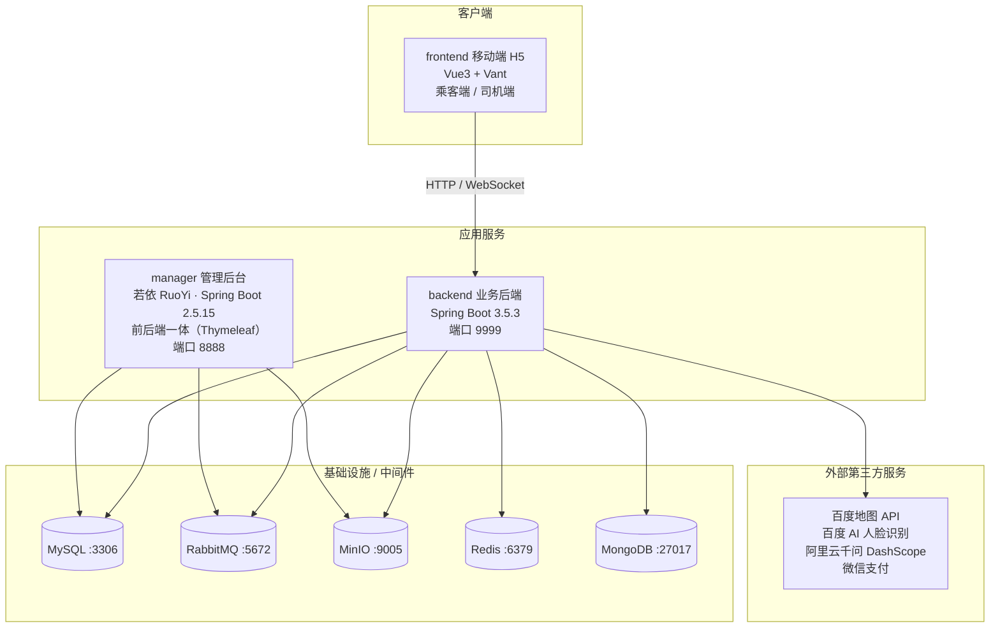

# 智驾游 (Hitch-Trip)

> 一款基于 **Spring Boot + Vue 3** 的顺风车 / 拼车旅游小程序，覆盖「乘客」与「司机」双角色端，并配套独立的运营管理后台。

---

## 一、项目简介

智驾游是一个 C 端顺风车拼车平台，核心场景是：

- **乘客**：发布出行需求（起点、终点、同行人数），匹配顺路的司机行程。
- **司机**：发布行程（起点、终点、空座数），承接顺路乘客。
- 系统基于地理坐标（经纬度 + GeoHash）进行路线匹配，生成订单，并支持线上支付。

除基础拼车能力外，项目还集成了 **AI 智能助手**（基于大模型的行程问答 / 智能问路 / RAG 知识库问答）、**实名认证**、**实时位置共享**、**即时消息** 等增强功能。

---

## 二、系统架构



项目由三个独立子工程组成：

| 工程 | 说明 | 端口 |
| --- | --- | --- |
| `backend/` | C 端业务后端（乘客 + 司机），核心业务逻辑所在 | `9999` |
| `manager/` | 运营管理后台，基于若依 RuoYi 二次开发 | `8888` |
| `frontend/` | 移动端 H5（Vue3 + Vant），乘客端与司机端双角色 | `3000`（开发） |

---

## 三、技术栈

### 1. backend —— C 端业务后端

| 维度 | 技术 | 版本 | 说明 |
| --- | --- | --- | --- |
| 基础框架 | Spring Boot | 3.5.3 | Java 17 |
| ORM | MyBatis | 3.0.3 | XML Mapper，`com.heima.modules.po` |
| 数据库连接池 | Druid | 1.2.23 | Alibaba |
| 关系型数据库 | MySQL | — | 业务库 `hitch` |
| 文档数据库 | MongoDB | — | 通知 / 聊天等数据 |
| 缓存 / 会话 | Redis + Spring Session | — | 会话共享 + 向量存储 |
| 消息队列 | RabbitMQ (AMQP) | — | 异步消息 |
| 实时通信 | WebSocket | — | 即时消息 / 实时位置 |
| 对象存储 | MinIO | 8.5.10 | 文件 / 头像 / 附件 |
| AI 大模型 | Spring AI | 1.1.8 | 千问 `qwen-plus`（DashScope OpenAI 兼容模式） |
| 向量检索 | Spring AI Redis VectorStore | — | RAG 知识库检索 |
| 文档解析 | Apache POI / PDF Reader | 5.2.5 | Word / PDF 入库 |
| 地图 | 百度地图 API | — | 路径规划、驾车距离矩阵 |
| 人脸识别 | 百度 AI SDK | 4.16.2 | 实名认证 |
| 支付 | wxpay-sdk | 3.0.9.1 | 微信支付 |
| 地理计算 | geohash | 1.4.0 | 顺路匹配 |
| 接口文档 | springdoc-openapi | 2.6.0 | Swagger UI |
| 工具库 | Hutool / fastjson / Lombok | — | — |

### 2. manager —— 运营管理后台

| 维度 | 技术 | 版本 |
| --- | --- | --- |
| 基础框架 | Spring Boot | 2.5.15（Java 8） |
| 脚手架 | 若依 RuoYi | 4.7.8 |
| 安全框架 | Apache Shiro | 1.13.0 |
| 视图模板 | Thymeleaf | — |
| 接口文档 | Springfox Swagger 3 | 3.0.0 |
| 数据库连接池 | Druid | 1.2.20 |
| 分页 | PageHelper | 1.4.7 |
| 定时任务 | Quartz | — |
| 验证码 | Kaptcha | 2.3.3 |
| 对象存储 | MinIO | 6.0.13 |
| 消息队列 | RabbitMQ | — |
| ORM 增强 | MyBatis-Plus Core | 3.5.15 |

### 3. frontend —— 移动端 H5

| 维度 | 技术 | 版本 |
| --- | --- | --- |
| 框架 | Vue | ^3.4.0 |
| 构建工具 | Vite | ^5.4.0 |
| UI 组件库 | Vant | ^4.8.0 |
| 路由 | vue-router | ^4.3.0 |
| 状态管理 | Pinia | ^2.1.0 |
| HTTP 请求 | axios | ^1.6.0 |
| 组件按需引入 | unplugin-vue-components + VantResolver | — |

---

## 四、项目结构

```
hitch-trip/
├── backend/                    # C 端业务后端 (Spring Boot 3.5.3, :9999)
│   ├── docker/Dockerfile       # 后端镜像构建
│   ├── pom.xml
│   └── src/main/
│       ├── java/com/heima/
│       │   ├── account/        # 账户 / 登录 / 实名认证
│       │   ├── stroke/         # 行程发布、匹配、计价、RabbitMQ
│       │   ├── order/          # 订单
│       │   ├── payment/        # 支付（微信支付）
│       │   ├── notice/         # 通知 / 即时消息 / 实时位置 (WebSocket)
│       │   ├── storage/        # 文件存储 (MinIO)
│       │   ├── aichat/         # AI 助手 / RAG 知识库问答
│       │   ├── commons/        # 公共工具、枚举、异常、AOP
│       │   ├── modules/        # PO / BO / VO 统一领域模型
│       │   └── configuration/  # 全局配置
│       └── resources/
│           ├── application.yml # 主配置
│           └── mapper/         # MyBatis XML
│
├── manager/                    # 运营管理后台 (若依 RuoYi, :8888)
│   ├── docker/Dockerfile
│   ├── pom.xml
│   └── src/main/java/com/ruoyi/
│       ├── hitch/              # 业务数据管理 (Account/Order/Vehicle/AiMsg/AiFiles)
│       ├── system/             # 若依系统管理
│       ├── generator/          # 代码生成
│       ├── quartz/             # 定时任务
│       └── web/                # 通用控制器 / 监控
│
├── frontend/                   # 移动端 H5 (Vue3 + Vant, :3000)
│   ├── vite.config.js          # 含后端代理配置
│   └── src/
│       ├── api/                # 接口封装 (account/order/stroke/payment/...)
│       ├── views/
│       │   ├── passenger/      # 乘客端页面
│       │   ├── driver/         # 司机端页面
│       │   └── common/         # 通用页面（个人中心 / AI 助手等）
│       ├── stores/             # Pinia 状态
│       ├── router/             # 路由（乘客/司机双角色）
│       └── components/         # 公共组件
│
├── hitch.sql                   # 数据库初始化脚本（业务库 + 若依系统表）
├── docker-compose.yml          # 后端 / 管理端容器编排
└── README.md
```

---

## 五、核心业务模块

### 1. 账户与认证（`account`）

- 用户注册 / 登录（Token 会话，Spring Session Redis 共享）
- **实名认证**：对接百度 AI 人脸识别
- **司机认证** / **车辆认证**：审核司机资质与车辆信息
- 支付密码、头像、个人资料管理

### 2. 行程与匹配（`stroke`）

平台的核心业务。行程模型基于地理信息：

- 乘客发布需求（起点 / 终点 / 同行人数），司机发布行程（起点 / 终点 / 空座数）
- 使用 **GeoHash** 对起终点坐标编码，进行顺路 / 路线匹配
- 对接 **百度地图驾车距离矩阵** 计算距离与预估时间
- 内置计价策略（`valuation`）估算费用
- 通过 RabbitMQ 异步处理行程相关的消息事件

### 3. 订单（`order`）

- 乘客行程与司机行程匹配后生成订单
- 记录乘客、司机、双方行程、距离、预估时间、费用
- 订单状态流转 + 乐观锁修订号（`revision`）保证并发安全

### 4. 支付（`payment`）

- 对接 **微信支付 SDK** 完成在线支付
- 支付流水、金额、支付渠道、交易单号管理

### 5. 通知与实时通信（`notice`）

- 基于 **WebSocket** 的即时消息
- 实时位置共享（`Point` / `Way` 页面）
- 消息中心，数据存储于 MongoDB

### 6. 文件存储（`storage`）

- 基于 **MinIO** 的对象存储，管理头像、车辆照片、附件等

### 7. AI 助手（`aichat`）

- 基于 **Spring AI** 接入阿里云 DashScope 千问大模型（`qwen-plus`）
- 支持**智能问路**（`AiRoute`）与行程问答
- **RAG 知识库问答**：PDF / Word 文档解析入库 → Redis 向量检索 → 大模型生成回答

---

## 六、数据库

业务库 `hitch` 中的核心业务表：

| 表 | 说明 |
| --- | --- |
| `t_account` | 用户账户 |
| `t_authentication` | 实名 / 司机 / 车辆认证信息 |
| `t_vehicle` | 车辆信息 |
| `t_attachment` | 附件 |
| `t_stroke` | 行程（乘客需求 / 司机行程） |
| `t_order` | 订单 |
| `t_payment` | 支付流水 |
| `t_chat_message` | 聊天消息 |
| `t_ai_files` / `t_ai_msg` / `t_ai_vector_ids` | AI 知识库文档、对话、向量索引 |

管理后台使用若依标准系统表（`sys_*`）及代码生成表（`gen_*`）。

> 完整表结构与初始化数据见根目录 `hitch.sql`。

---

## 七、快速启动

### 环境依赖

| 服务 | 端口 | 说明 |
| --- | --- | --- |
| MySQL | 3306 | 业务库 `hitch` |
| Redis | 6379 | 会话 / 缓存 / 向量 |
| MongoDB | 27017 | 通知 / 聊天（库 `notice`） |
| RabbitMQ | 5672 | 消息队列 |
| MinIO | 9005 | 对象存储 |

### 1. 初始化数据库

```bash
mysql -uroot -p < hitch.sql
```

### 2. 启动业务后端

```bash
cd backend
mvn spring-boot:run          # 或 mvn package && java -jar target/backend-1.0-SNAPSHOT.jar
```

后端默认监听 `:9999`，接口文档（Swagger UI）位于 `http://localhost:9999/swagger-ui/index.html`。

### 3. 启动管理后台

```bash
cd manager
mvn spring-boot:run
```

管理后台监听 `:8888`，初始管理员账号由 `hitch.sql` 的 `sys_user` 表创建，首次登录后请立即修改默认密码。

### 4. 启动移动端

```bash
cd frontend
npm install
npm run dev
```

前端开发服务器监听 `:3000`，已配置 `/account`、`/stroke`、`/order`、`/notice`、`/storage`、`/payment`、`/ai` 到后端 `:9999` 的代理。

### 5. 关键配置

后端 `backend/src/main/resources/application.yml` 中需按实际环境修改：

- 数据源 / 中间件地址（默认 `192.168.64.100`）
- `spring.ai.openai.api-key`：阿里云 DashScope API Key（千问大模型，未配置则 AI 功能不可用）
- `minio.*`：MinIO 连接信息
- `baidu.*`：百度地图 / 百度 AI 密钥

---

## 八、部署

项目已内置 Docker 化支持：

```bash
# 构建镜像（依赖 pom.xml 中的 docker-maven-plugin）
cd backend && mvn docker:build
cd manager && mvn docker:build

# 容器编排
docker compose up -d
```

`docker-compose.yml` 编排两个服务：

| 容器 | 镜像 | 端口映射 |
| --- | --- | --- |
| `backend-app` | `backend:1.0-SNAPSHOT` | `9999:9999` |
| `manager-app` | `manager:0.0.1-SNAPSHOT` | `8888:8888` |

---

## 九、说明

- 本项目为教学 / 课程类项目（包名 `com.heima` / `com.itheima`），供学习参考。
- 代码中保留了若干硬编码的外部服务密钥（百度 / 微信 / MinIO 等），正式使用前务必替换为自有密钥并改用环境变量或配置中心管理。
